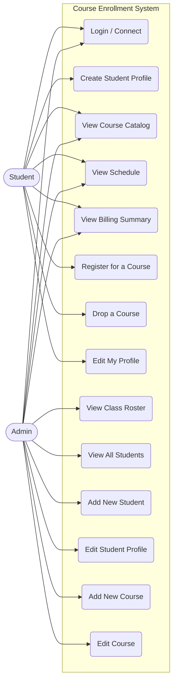
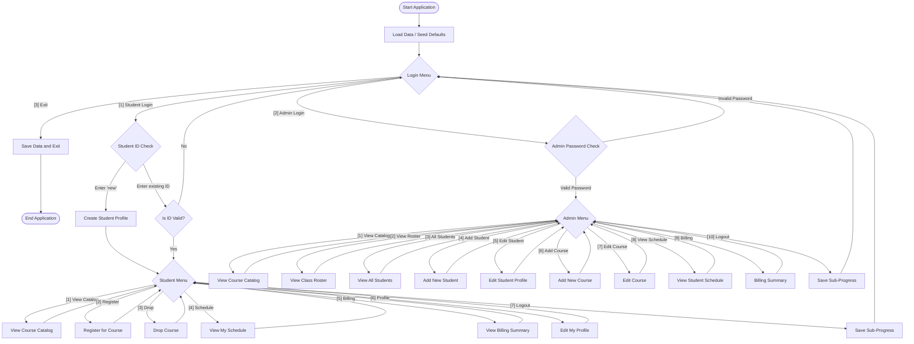

# unknownapp
This is an unknown application written in Java

---- For Submission (you must fill in the information below) ----
### Use Case Diagram
# unknownapp
This is an unknown application written in Java

---- For Submission (you must fill in the information below) ----

### Use Case Diagram

### Flowchart of the main workflow

### Prompts
I have a Java project built for Course Enrollment. Please review the codebase to understand how the business logic works. Once you understand the system, extract the logic for the register for a course use case and rewrite a standalone, functional equivalent of it in Python. You will need to bring over any relevant models and validation rules to make it work. Please save the output file inside a new folder called python in my workspace root.
